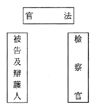
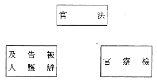
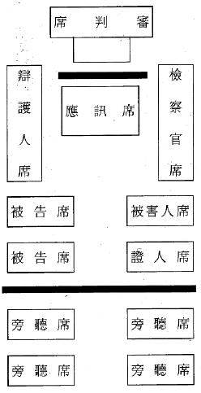

## 2-2 刑事法庭席位之改造

#### 提案一（提案者：司法院、法務部、民間團體）

硏議刑事法庭中檢察官與被告席位之設置

##### 背景說明：

一、法院組織法第八十四條第二項規定：「法庭内開庭時，在法庭實施訴訟程序之公務員及依法執行職務之人、訴訟當事人與訴訟關係人，均應設置席位；其席位布置應依當事人平等之原則爲之。」但現在刑事法庭的布置，將法官席、檢察官席、辯護人席、被告席分開，其中檢察官與辯護人的席位，分置於法官席位兩側，被告席位設於法官對面欄杆後方，於應訊時起立上前，在欄杆後應訊。如此的席位設置，有下列兩個問題：㈠破壞刑事訴訟中的三面關係，形成四

面關係的現象；㈡不符合當事人平等原則，使立於原告地位的檢察官在先天上凌駕被告之上。實則法庭席位布置，影響各訴訟當事人的心理機制、參與訴訟者的尊嚴、刑事訴訟法所揭橥的權利能否落實、審判程序活動得否具體發揮，非僅位置形式上的象徵意義而已。爲符合現代刑事訴訟制度彈劾主義的三面訴訟關係構造，貫徹當事人對等原則，應使檢察官與被告席位對等設置。（司法院提）

二、刑事法庭席位之設置，因刑事訴訟制度所採行之模式及檢察官角色之不同，而有不同的設置方式，例如法國刑事法庭席位之設置，法官與檢察官之席位同高，辯護人席位則在法官席左前下方或正前下方，高低甚爲懸殊；德國聯邦最高法院刑事法庭，檢察官與法官之法檯同高，辯護人之法檯則與檢察官相對，但高度較低；日本刑事法庭檢察官與辯護人席位相對，分置於法官席兩側，被告席則面對法官席，在旁聽席之前，被告並未與辯護人同座。故我國刑事法庭席位之設置，必須視未來刑事訴訟法修正之方向及檢察官之角色定位等因素決定之。（法務部提）

##### 具體方案：

###### 甲案（司法院、民間團體提）

法官、檢察官、被告（與辯護人同座）席位成馬蹄形三方關係，檢察官與被告對向而坐：

立法例：德國現制

實施步驟及時間：先與法務部協商，經本會討論決議後，即修正「高等法院以下各級法院法庭席位布置規則」，預計於八十八年十二月三十一日完成。

###### 乙案（司法院提）

法官位於中間，檢察官與被告（與辯護人同座或辯護人坐於被告後方）同在法官對面，檢察官席位與辯護人席位同高：

實施步驟及時程：先與法務部協商，經本會討論決議後，即修正「高等法院以下各級法院法庭席位布置規則」，預計於八十八年十二月三十一日完成。

###### 丙案（法務部提）

在現行刑事訴訟制度未變更前，法官、檢察官、辯護人席位及法台高度仍維持現狀，但爲使辯護人在法庭上容易與被告討論及交換意見，可將被告席置於辯護人席右側，被害人（或證人）席置於檢察官席左側，另仍維持目前之應訊席，以利法庭辯論活動之進行（詳附圖）。

##### 分組會議

結論整合小組協商後仍無法形成共識，爰就原提案甲、丙二案文字修正後併陳，並分別列舉贊成者之姓名及人數如下：

###### 甲案：法官、檢察官、被告（與辯護人同座）席位成馬蹄形三方關係，檢察官與被告、辯護人對向而坐，席位同高。

贊成者二十七人

古嘉諄、池啓明、江春男、李相助、林明德、林堭儀、林勤綱、林輝煌（審）、周村來、紀俊乾、段重民、范光群、高志尚、高育仁、莊勝榮、常照倫、陳明義、陳運財、陳傳岳、陳憲裕、黃旭田、黃秀眞、黃敏雄、黃朝義、曾有田、彭紹瑾、顧立雄 。

###### 丙案：詳見議題資料中的丙案

贊成者十人

王光宇、李太正、林輝煌（檢）、陳元鎭、陳玉珍、楊思勤、游乾賜、蔡秋明、蔡碧玉、謝文定，

不在場或由代理人在場者二人：丁原進、陳健民

##### 全體會議

經結論整合小組協商後，無法達成共識。

##### 表決結果

贊成甲案者八十六人：

李遠哲、尤美女、江松鶴、江鵬堅、吳志清、李念祖、李震山、李鴻禧、林大洋、姜志俊、莊崑山、許志雄、許宗力、張作錦、陳清秀、陳惠馨、彭鳳至、黃正彥、黃武次、黃瑞華、黃肇松、楊仁壽、楊國樞、楊隆順、廖宏明、蔡明憲、鍾曜唐、簡錫堦、丁原進、古嘉諄、池啓明、江春男、李相助、林明德、林益山、林堭儀、林勤綱、林輝煌（審）、周村來、紀俊乾、段重民、范光群、高志尚、高育仁、莊勝榮、常照倫、陳明義、陳運財、陳傳岳、陳憲裕、黃旭田、黃秀眞、黃敏雄、黃朝義、曾有田、彭紹瑾、顧立雄、王如玄、王錦村、呂太郎、李家慶、林子儀、林

國賢、林錦芳、周占春、韋端、范巽綠、莊碩漢、許慶復、張升星、張世興、張富美、陳錦隆、黃文圝、黃立、黃宗樂、黃國鐘、黃教範、黃榮村、廖義男、劉幸義、劉瑞村、歐育誠、蕭新煌、魏千峰、吳運東

贊成乙案者二人：

朱武獻、越方如

贊成丙案者二十四人：

江惠民、李進誠、邵良正、莊春山、蘇永欽、王光宇、李太正、林輝煌（檢）、陳元鎭、陳玉珍、朱楠、吳英昭、游乾賜、楊思勤、蔡秋明、蔡碧玉、謝文定、朱坤茂、林永義、曾勇夫、盧仁發、顏大和、魏早炳、江義雄

其他一人：未具名

##### 主席報告

經四位副主席協商，無法達成共識之原因爲：

葉部長金鳳贊成丙案。

城副院長仲模、邱教授聯恭、陳理事長長贊成甲案。
