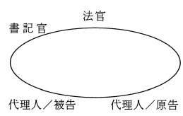

## 3-6 關於「司法官養成敎育環境——法學院之組織」之臨時提案

（劉幸義提）

##### 分組會議結論：

「法學院得不設學系，而依法律專業領域分設硏究所。教師歸屬硏究所；學生直接歸屬法學院，得分設學士班、碩士班與博士班。」之意見應予重視，由司改會轉送教育部參考辦理。

##### 全體會議結論：

對分組會議結論有異議，經投票表決，以贊成者五十六人、反對者五十四人，贊成多於反對者，成爲全體會議結論。

附帶建議

##### 分組會議結論：

建議一：建議考試院對律師考試儘量增加錄取名額。

建議二：建議成立監督機制，以監督本次大會決議之執行。

##### 全體會議結論：

分組建議事項獲無異議通過，成爲全體會議結論。

#### 如何建立一個爲人民信賴的司法—參加全國司法改革會議對司法改革的建言

范光群提

前言

隨著經濟的成長及政治民主化的的漸趨完成，我們的國家應該正視並努力於法治的建立、社會正義的實現，以及人性尊嚴的提昇，以迎接第二十一世紀的到來。司法職司民刑訴訟、行政訴訟的審判、公務員的懲戒，以及人權的保障等工作，其好壞與法治的建立、社會正義的實現以及人性尊嚴的提昇，可說是息息相關。然而，不容請言，我國司法長期以來，不能獲得人民的信賴與尊重，有越來越多的「有錢判生、無錢判死」以及「司法已死了」的沈痛批評。

面對著台灣政治經濟的快速進步，面對著第二十一世紀的即將到來，更面對著這樣一個令人不滿意的司法，没有人會否定改革司法的必要性及迫切性。事實上，司法改革早爲朝野所共識，在政府方面，不但李登輝總統一再宣示把司法改列爲國家改革的重點，司法院也於八十三年十月成立司法改革委員會，積極推動司法改革，在野方面，也有「民間司法改革會議」的舉行及「民間司法改革基金會」的成立，試圖以民間的力量，推動司法改革。希望朝野司法改革的努力，能夠發揮成效，使我國司法脫胎換骨，獲得重生。

問題是，司法要如何改革？本人有幸而參與上述司法院以及民間的司法改革，深深體會到司法改革是一非常艱鉅的工程，有著太多現實面的困難及限制，也有著來自被改革者的巨大阻力。因此，本人願特別強調，如果改革而不具理想性、不具開創性、不具前瞻性，如果參與改革者尤其是主持改革者没有足夠的決心及魄力，那就不可能有較突破格局的改革，而改革的成效亦必極其有限！同時，本人也要呼籲政府，尤其是主導改革的司法院，應痛切認知改革司法是自己所肩負無所旁貸的責任，應體察人民對司法改革要求的迫切，珍惜民間司法改革的力量，重視民間的改革意見，以大魄力進行改革，我們的司法才得以脫離舊困而獲得重生。

我們司法之病，千頭萬緒，旣互相糾結牽連，也常互爲因果，改革的方向，應朝向建立一個民主而平民化，親民而有效率，具人性而能維護正義並保障人權的司法來努力。唯有如此，才有可能建立一個爲人民信賴的司法。在做法上，雖然應該顧及現實，但是仍應強調理想。如果我們只受限於現實、牽就於現實，不敢有所突破，不具理想性，我們司法改革勢必因欠缺「改革精神」，而難有成效，因此，假如理想的改革，因現實問題而無法一蹴可及，我們應該用「階段論」解決，也就是說，可以設定一定的改革階段，一步步的達到理想改革，不能因有現實的困難，即牽就現實而放棄理想。這是司法改革，在做法上要很注意而加重視的。

在這國民主權的時代，司法不再是代表威權以統治人民的工具。我們應遵循國民主權的思想，使司法民主化且平民化，我們也應依權力分立及互相制衡的原理，使司法發揮保障人民權益及人權的功能，也唯有如此，才可能建立爲人民信賴的司法。

「全國司法改革會議」，經民間團體多年來一再努力催告，終於召開了，這是司法改革的大事，也是司法重生的契機，本人謹就司法改革建言如下：

一、司法院定位：司法院應審判機關化並採一元化單軌制

㈠我國現制，司法院本身不審理訴訟，而爲司法行政機關，致使最高審判機關諸如最高法院、行政法院、公務員懲戒委員會之上，尚有司法院，造成司法行政權凌駕審判權的怪象，此一怪象亦使人產生我國審判能否獨立的疑慮。因此，多年來識者無不主張司法院應審判機關化，而司法院第一階段的司法改革委員會第一硏究小組經一年的討論，亦確定了司法院應審判機關化的結論。

㈡問題是，要怎樣審判機關化？司法院司法改革委員會第一小組關於「司法院定位」議題，自民國八十三年十月起經一年的討論結果，所提出的改革方案有下列三方案：

1. 第一案：一元化多軌制

司法院名稱不變，但予以最高法院化，亦即變爲最高審判機關。除原有大法官會議及憲法法庭合併爲憲法法庭外，將現制最高法院、行政法院及公懲會併入司法院，改設民事庭、刑事庭、行政訴訟庭及公務員懲戒庭，行使憲法賦予的職權。

2. 第二案：二元化雙軌制

司法權由憲法法院與最高法院曁其所屬各級法院行使之。⑴設憲法法院，不再有司法院或大法官之制；⑵合併最高法院、行政院、公懲會爲最高法院；⑶由憲法法院、最高法院分掌釋憲權、審判權；⑷憲法法院與最高法院爲獨立而不相隸屬之二機關。

3. 第三案：一元化單軌制

  1. 司法院設大法官十二至十五人，掌理民事、刑事、行政訴訟之審判、公務員之懲戒及憲法之解釋，並置助理大法官若干人，襄佐大法官。

  2. 大法官由總統提名經國會同意任命之，任期九年。

㈢首先，檢討現行制度，有下列現象：

1. 最高的各審判機關適用憲法、法律意見不同而導致相互矛盾、衝突；

2. 如發生上述情形或人民憲法所保障之權利受不法侵害，經依法定程序提起訴訟，對於確定終局裁判所表示之法律見解發生有顯然牴觸憲法之疑義者，亦得聲請大法官會議釋憲以爲救濟。

以上1.、2.均應由大法官會議釋憲並統一法令之解釋。此種制度設計，難免有如下的缺點，即：1.各最高審判機關見解互相矛盾、衝突，影響司法信譽；2.各最高審判機關所做的確定判決，可能因大法官會議做不同之解釋而推翻其效力，致使最高審判機關之確定裁判，效力不確定，甚且產生於最高審判機關之上，尚有更高一級審判機關之疑義，（參司法院大法官會議釋字第一七七號、第一八五號、第一八八號、第一九二號解釋）。以上缺點均影響司法制度的完善，宜設法避免。

㈣司法改革委員會第一小組關於「司法院定位」議題討論結果，認：1. 有關法令之統一解釋，其解釋權與審判權原則不可分離，應合一行使；2. 釋憲權與審判權合一而不分割行使，乃符合制憲者最初之構想，且可避免雙頭馬車相互扞格之疑慮（參見該報告第六頁關於對第三案利弊分析之I利1及3 ）。按司法之本質即爲審判，無審判即無司法，法之生命應寓於審判，而「法」則應透過審判以驗證其存在，本人贊成第一小組上開結論，即無論憲法或法令之統一解釋，其解釋權與審判權原則應合一行使，不可加以分割，並以此列爲檢討各案優少力之標準。

㈤司法院的定位，關係國家憲政的結構，影響將極爲深遠，實爲司法改革的重點。我們應該要堅持改革精神，以富理想性、前瞻性的態度，來爲國家建立一個可長可久的制度，不應太牽就現實輕易放棄理想。檢討上列三案：

1. 第一案及第二案，均有上㈢述的缺點，而第三案因採單一最高司法機關制度，亦即所謂一元化單軌制，以司法院爲唯一的最高司法機關，不分設各庭而以大法官若干人掌理民事、刑事、行政訴訟及憲法之解釋，不但可避免上開缺點且有㈣所述解釋權與審判權合一行使之優點。就此而言，該案應屬較爲理想的制度。

2. 第一案採一元多軌制，以司法院爲最高司法機關，分設憲法法庭、民刑事、行政訴訟、公務員懲戒各庭，行使憲法賦予的職權，雖仍難免有上㈢所述的缺點，但有下列的優點：

  1. 司法院實質上完全審判機關化，符合憲法第七十七條規定的意旨。

  2. 把現在大法官會議及憲法法庭合併爲憲法法庭、最高法院、行政法院、公務員懲戒委員會併入司法院，成爲司法院的民事庭、刑事庭、行政訴訟庭、公務員懲戒庭，不必修憲，較簡易可行。

    至於各庭間法律見解的可能衝突，則可設大法庭以爲解決。因此，第一案雖不如第三案理想，但仍爲一可採行的制度。

3. 第二案採二元雙軌制，由憲法法院與最高法院分掌釋憲權及審判權，把司法權分化成雙頭馬車，除有上㈢所述缺點外，尚有造成二個最高司法機關對峙之可能，如此，自有礙司法信譽的建立。

4. 第三案屬較理想的制度有如上述，茲檢討其可行性：

  1. 是否應經修憲？

    雖憲法第七十九條第二項規定「司法院設大法官若干人，掌理本憲法第七十八條規定事項，……。」憲法增修條文第十三條第二項規定，「司法院大法官，除依憲法第七十八條之規定外，並組成憲法法庭，審理政黨違憲之解散事項。」但此等規定，並不排除具有法官身分的大法官掌理憲法第七十七條所定民事、刑事、行政訴訟之審判及公務員之懲戒職權之可能性。只要在司法院組織法、法院組織法做相當的配合修正，應可使大法官兼掌上述審判及懲戒職權而不發生違反憲法規定的問題。因此，採第三案並不一定要修憲。

  2. 現實可行性如何？

    1. 要採行第三案，勢必面臨如何解決現任大法官、最高法院法官、行政法院評事以及公務員懲戒委員會委員的地位保障問題。在基本上，現任大法官可予留任，而最高法院法官、行政法院評事、公務員懲戒委員會則可透過特別立法予以轉任。如此，不但有助於單一最高審判機關制度（一元單軌制）的早日建立，也藉此可促使資深法官回流到二審及一審，有助於一審及二審審判功能的加強，雖改革幅度較大，仍應勉力爲之。

    2. 由於單一的最高審判機關掌理全國的民事、刑事、行政訴訟，公務員懲戒及釋憲，以少數之大法官受理衆多案件，爲確保品質，除如③所述應修改民刑訴訟法以限制上訴三審外，有必要爲每一大法官設置大法官助理或助理法官若干人，以襄助大法官。

    3. 爲避免有過多的上訴三審案件，影響最高審判機關功能的正常發揮，應修改民刑訴訟法，適當限制上訴第三審，但應先做好週邊制度，即民刑訴訟應確實改善第一審事實審的品質以發揮其事實審之功能，而第二審上訴則改爲事後審制。

  3. 一元單軌制的單一最高審判機關，是否會因審判權與釋憲權合一，致使釋憲功能不彰？此在美國及日本，可能有不同的經驗。日本經驗對其最高裁判所的釋憲功能，雖有未盡理想的批評，但是，美國最高法院的釋憲功能，似無人能加以懷疑。可見，影響釋憲功能者，並非「一元單軌制」的制度上問題，而是牽涉到大法官任命是否適當的問題。事實上，如採一元單軌制，不但可寓釋憲於訴訟的審判之中，且釋憲權可下放至各級法院，似反可彰顯法院的釋憲功能而促進憲法的普及及發展。

㈥綜上所述，關於司法院的定位，應以採第三案一元單軌制的單一最高審判機關制度，較爲理想，也有其現實的可行性，希望能朝採此案的方向來努力。

㈦如認採行第三案的改革幅度甚大，考慮配合現實，以漸進的方式達到此一制度的實現，則可考慮第一案做爲過渡階段的制度。但是，應明白宣示第一案僅爲過渡性質且將於一定期間内（例如在本屆大法官任期屆滿下屆大法官就職時）完成採行第三案的改革。其方法，可規定最高審判機關（司法院）「得」設憲法法庭、民事審判庭、刑事審判庭、行政審判庭、公務員懲戒庭。把現有的大法官會議、最高法院、行政法院、公務員懲戒委員會歸併爲上列各庭，經過一定期間，因退休、任滿而逐步完成單一最高審判機關的理想。

二、關於法官素質提升的問題

司法的重心在審判工作，而審判工作是由法官來做。我國憲法保障法官的審判獨立不受任何干涉，而訴訟制度又採法官的自由心證主義，因此，法官素質的好壞，直接影響審判品質的好壞，也當然直接影響司法的好壞。關於法官的素質問題，我們遭遇的問題是：㈠一審法官多爲候補法官，年輕而欠缺人生歷練，難爲當事人信服；㈡法官觀念保守，常未能把握社會進步的脈動。其改進之道：

㈠改革候補法官辦案制度：1. 在基本上，候補法官還不是憲法第八十條及第八十一條所稱的法官，不應擔任審判工作，而只可擔任法官助理工作，如此才符合憲法的規定，並可藉法官助理工作，增加其歷練。必待候補期滿（目前爲五年），才可參與審判工作。2. 候補期滿後，應先參與合議制的審判，經過一定期間後，才可使其擔任獨任審判。

㈡法官來源應多元化：1. 應考慮增加法官任用的管道，從律師界、法學界直接引進第一審、第二審、第三審的法官。如此，不但可直接引入優秀且有經驗的法律人才充任法官，也可爲保守的司法界隨時注入新血，以適應社會進步的脈動。2. 將來應廢除法官考試，而從律師界、法學界遴選法官。

三、關於司法風紀的改善問題

所謂「有錢判生，無錢判死」，正點出我國司法風紀問題的嚴重。不可諱言，我們確實有相當的一部分法官，其操守是有問題的，如讓這些貪贓法官終身長期混雜在司法，從事審判工作，斷人是非而定人生死，司法制度再好，也不可能有清明的司法。因此，談司法改革，首要之事，就是要政府拿出決心及魄力，動用一切力量，把這些司法敗類揪出，繩之以法而加以淘汰，唯有如此，我們的司法才有可能重生。

四、法官評鑑制度應從速建立

我們授予法官以「審判獨立」的絕對權，而享有此一影響人民生命、身體自由、財產權益的絕對權的法官是人，而非神，如果没有相當的制衡、監督，難免會濫權，會反過來使人民受害。事實上，依我國司法過去的實證經驗，司法官確有不少濫權及貪污情事，以致司法不爲人民所信賴及接受，甚至被評爲「司法已死了」！要醫治此一司法之病，法官評鑑實爲對症之藥。因此，法官評鑑制度之建立，不但有其理論基礎，且有其實證經驗上的必要。法官的評鑑，應包括法官的品德操守及在具體案件的審判品質。此外，也應調查法官及其配偶子女的財產，是否與其正當收入顯不相當？須知見林雖未見樹，樹必在林中，如發現法官的財產與其收入顯不相當，而無合理的來源說明，認定其操守不良，必不冤枉。能貫徹評鑑，必能有效遏止法官貪漬，防止法官濫權，進而提昇審判品質，建立司法信譽。

當然，審判獨立的維護是不能打折扣的，此所以憲法重視法官身份地位的保障，而我們也主張法官自治。法官評鑑雖有其必要，但要注意不能因此而損害審判獨立，尤其不可因此讓司法行政權凌駕於審判之上。如何求取二者間的平衡，値得慎思。本乎以上的理念，謹就法官評鑑，提出下列看法及建議：

㈠爲避免司法行政權侵害審判獨立，主持評鑑的機關應該是一個「獨立」機構，就長程理想言，應獨立於司法院以外，依特別立法而設立，該機構置於總統之下，其首長及主要成員由總統任命，以獨立超然的地位，負責規劃、執行法官評鑑事務。

㈡「法官評鑑」與「評鑑效果」應予區隔。也就是說，評鑑委員會只負責評鑑的工作，將評鑑結果公布，它不過問法官獎懲有關事項。至於評鑑結果應如何加以評價？對法官升遷獎懲有何影響？則是另外一回事，應由司法院、法官會議，甚至於監察院各依其權責自行決定。如此的區隔，有其必要：

1. 評鑑制度本身，對法官已能發生相當大的監督力量，没有法官敢無視於評鑑的結杲，因爲，此項結果會適當的公布於社會，對其名譽有一定的影響，對其升遷獎懲亦「可能」發生影響。

2. 如果我們試圖賦予評鑑結果以一定的獎懲效果，基於對法官地位的應有保障，評鑑所憑資料是否符合嚴格的證據要求？有無給予法官以應有的答辯機會？評鑑程序是否符合嚴格程序正義？等等諸多問題都將發生，其結果，勢必反而導致評鑑業務的無法推展，限制評鑑功能的發揮。例如，法官辦案態度是否認眞、良好？法官風評是否良好？其審判品質是否低劣？這一類一般性評鑑的結果，本不宜直接賦予一定之法律效果，如一定要賦予法律效果，勢必因此使得這些評鑑無法採行，而限制了評鑑制度的推行。

3. 評鑑的結果，雖無直接的法律效果，但是，評鑑委員會會把它.爲適當的公布並送給與獎懲有關之機關單位（諸如監察院、司法院、法官所屬法院）參考，它還是有可能成爲另一獎懲程序發動的基礎。因此，它雖無直接的法律效果，但卻有間接潛藏的法律效果。

4. 不賦予評鑑結果以直接的法律效果，使評鑑委員會的職權，只侷限於規劃並執行評鑑，而不具有獎懲的權限，可以保持評鑑委員會的「中性」及「超然」立場，防止其與司法行政權結合而侵害審判瀰立。

㈢評鑑項目及方法

1. 審判品質的評鑑

  1. 程序正義品質的評鑑：

    此項評鑑主要是對法官審理案件，在程序上能否尊重訴訟關係人，並給予當事人、代理人及律師充分陳述之機會。

    其方法：①開庭採全程錄影、錄音，委員會得隨時調取上開錄影、錄音予以評鑑；②評鑑委員會得隨時對特定對象，派員至法庭旁聽，以瞭解開庭狀況。

  2. 實質正義品質的評鑑：

    此項評鑑主要是對法官就具體個案裁判是否妥適，於案歸確定後做品質評鑑。其方法：①評鑑委員會延聘資深法官（包括優遇法官）、資深律師及法學教授組成個案評鑑小組，就個案評鑑。受評鑑案件之來源，可以抽樣，亦可接受由訴；②把法官判決遭上級法院因認事用法違誤而廢棄、撤銷之比率，做爲一般品質之評鑑依據。

2. 品德、能力、辦案態度等風評評鑑

  1. 就法官一般的品德風評，可由轄區律師以多元及普遍性的方式參與問卷式的評鑑。

  2. 對受裁判之當事人進行問卷式的評鑑，但應區隔受有利判決當事人及不利判決當事人之意見，而予不同之評價。蓋受不利判決當事人一般對承審法官爲否定之評價，乃屬常態，故應不予重視，但如竟爲肯定之評價，則應重視；同理，如受有利判決之當事人所爲肯定之評價，應不予重視，但如竟爲否定之評價，則應予重視。

  3. 財產評鑑，對法官之財產是否與其收入顯然不相當進行評鑑，如顯然不相當，應將其情形公布。如前所述，見林雖未見樹，樹必在林中，法官財產與其收入顯不相當，質疑其品德，少有冤枉。

3. 至於其他評鑑之項目、方法，由評鑑委員會負責規劃並執行之。

㈣評鑑結果之處理

評鑑結果，由評鑑委員會以適當方法公布並函送有關機關、單位參考。

四、關於加強第一審事實審功能的問題

㈠如前所述，司法改革的方向及目的，應朝向建立一個清明而有效率，具人性且能維護正義及人權的司法。這樣的司法，才能眞正得到人民的支持及信賴，也才能建立起司法的威信，從而發揮司法做爲三權或五權中一權的制度上應有功能。司法功能的展現，主要是在審判工作上，如果有好的審判，司法自然能得到人民的支持及信賴，司法的信譽自然建立，司法功能由是而發揮。

㈡檢討我們目前司法信譽不彰，不爲人民所肯定，最大的問題在於審判品質的低落！詳言之：

1. 在程序正義方面，站在人民的立場，起碼的要求是當事人及訴訟關係人在訴訟程序中，其地位要被尊重，要有人的尊嚴（須知，法院應是人權獲得保障及人最有尊嚴的地方）！其次，在訴訟程序中，要讓他們有充分表達的機會。但是，目前實務上，當事人在訴訟程序中往往不被尊重，且又常常没有充分表逹的機會，此在刑事審判尤其嚴重。一場訴訟，法院還没下判決，當事人已覺傷痕縈桑，怨氣沸騰！

2. 在實質正義方面，我們有不少違反正義的裁判，更常見突襲性、出乎當事人意料的裁判。而裁判的理由又甚多不具說服力！須知，裁判結果違反正義，裁判的高度無法預測性，其本身就是違反了法治的基本精神及原則，構成對司法的根本傷害。

㈢要如何改革，以提高程序的正義及實質的正義？可以說牽涉甚廣。本人認爲下列幾項，是改革的重點：

1. 應防止突襲性裁判

  1. 法官心證應公開，即在言詞辯論終結前，法官應公開其心證，使當事人能有充分的辯論。

  2. 凡欲作爲裁判基礎的事實爭點、法律爭點及相關證據的證明力，非經言詞辯論時逐一提示當事人辯論，不得爲裁判的依據。

2. 法官心證的監督應予加強

  判決應詳敘理由。對於受不利裁判的當事人，其所提出的攻擊防禦方法以及上訴、抗告的理由，如不予採取，判決應逐一詳述其理由，使當事人得以信服。

3. 刑事審判應區分認定事實與量刑的程序刑事審判工作主要在於認定犯罪事實與科刑。在我國，認定犯罪事實與科刑都由同一法官爲之，而且其調查及辯論程序也是混合進行。如此，有下列顯著的缺失：

  1. 在犯罪事實成立與否尚未認定以前即先調查與犯罪事實無關的科刑資料（諸如前科、素行等），容易使法官對被告形成先入爲主的主觀觀念，影響認定犯罪事實成立與否的心證，致未能公正審判。

  2. 犯罪事實有無的認定，與應如何科刑，爲同等重要的程序，其影響於被告權益者，均至爲重大。由於實務上兩程序混同進行的結果，無論在調查或在辯論程序，都只重前者而忽略後者，法官於判決認定被告有罪時，多僅憑自己主觀之意念量刑，致科刑過程粗糙而往往未能爲適當之科刑。爲使審判更爲公平及精緻化，應區分認定事實與量刑的程序，修法明定：

    1. 認定事實程序與量刑程序應予區分爲兩個不同的程序。

    2. 量刑程序即與科刑有關事項之調查及辯論，於宣示被告有罪後，始得進行。

4. 合議制審判應貫徹合議的功能

  1. 爲貫徹直接審理主義，合議制審判原則上不得使受命法官調查證據，而應由合議庭直接調查證據，如此，自由心證才有其基礎。

  2. 記載評議内容的評議簿，依現行法院組織法第一〇六條規定，於案件判決確定後三年内應嚴守秘密。這有違法官應對人民負責的原則，甚爲不妥。爲使法官本於獨立審判精神，充分對人民負責，應删除上述法院組織法的規定，使評議内容隨時公開。

  3. 判決書應表明書寫該判決的法官的姓名，如參與合議的法官對判決有不同意見，應提出不同意見書，以突顯法官獨立審判的精神並明其責任。

5. 限制候補法官參與審判

  由於我國一向強調審判獨立，而訴訟制度又採自由心證主義，因此，審判的好壞與法官個人的品質，可謂有直接的因果關係。我國目前的法官考用制度，容許衆多年青無經驗的人充當法官從事審判，其難獲得人民的信賴，乃屬必然。因此，法官考用制度的改進以及法官品質的提昇，實乃是改革的重點。惟在獲得改善以前，針對時弊，起碼要做到候補法官不得參與審判，以確保審判的品質，其詳前已述及，在此不復贅述。

六、關於第二審改採事後審的問題

㈠我國目前第二審採的是續審制度，也就是說當事人可以在第二審言詞辯論終結前提出新的訴訟資料即攻撃防禦方法，當事人在第一審所爲的訴訟行爲在第二審繼續有效，而第二審須再一次依自由心證判斷事實眞僞而爲裁判。

這樣的制度，雖有延長提出攻擊防禦方法的時間，對當事人的訴訟權益保障較爲有利的優點，但是，它卻有下列的缺點：

1. 有二個事實審，就同一訴訟事件有二次的法院自由心證，第一審事實審的重要性相對減低，其功能亦因此減損。這樣的設計，意味著制度上的自我否定。

2. 二個實審，增加訴訟程序的重複性，不但造成司法資源的浪費，且亦稽延訴訟的順利終結，延長並增加當事人的訟累。

3. 民事因採續審制而非覆審制，當事人在第一審所爲的訴訟行爲在第二審仍繼續有效。因此，在第二審無法貫徹直接審理主義，（例如第一審訊問的證人，第二審可不必重新訊問，逕以第一審證人證言爲裁判之依據。）其自由心證即失所據而有違直接審理的精神。然而，第二審的自由心證效力卻優於第一審，而可推翻第一審的自由心證結果，其正當性是有疑問的。

4. 由於有二個事實審，有二次自由心證機會，當事人爲尋求第二審較具權威的自由心證機會，没理由不提起上訴。如此輕一審重二審的結果，自難減少二審上訴案件，二審法官的負擔，亦隨之加重。

㈡基上說明，第二審民事採續審制刑事採覆審制，實在是弊多於利，應設法改進。最理想的方法，是把第一審定爲事實審的終審，第二審改爲法律審。但是，由於目前大家對第一審的審判品質實在没有足夠信心，如遽然定爲事實審的終審，恐影響當事人權益太大，因此，折衷先把第二審改爲事後審，是値得大家嚴肅思考的方向。所謂事後審，就是第二審只就第一審的訴訟資料，事後審查第一審裁判是否正當。在第二審，原則上當事人不能提出新訴訟資料。第二審法院如認第一審裁判正當，就駁回上訴，如認爲不正當，原則上要把第一審裁判廢棄或撤銷，發回原審法院更審。日本刑事訴訟法的第二審，就是採事後審制，奧國民事訴訟的第二審，也是採事後審制度。

㈢把第二審改爲事後審，雖然較續審制爲理想，但不可冒然而爲，必須要先改進並健全第一審的審判。總言之，在加強第一審事實審功能的週邊制度無法充分配合下，是不可輕易採行第二審事後審制度的，否則，被犧牲的必然是人民的權益及司法的威信。

七、法庭席位的民主化及平民化問題

傳統的法庭席位安排，爲法官高高在上，當事人及律師則在下面，法官在上俯視，而當事人及律師則在下仰望，充分顯示法官爲審判者當事人爲被審判者的主體客體關係，亦顯示了審判者與被審判者間存在著威權統治的緊張關係。這樣的法庭安排，其合理性如何？有無理論依據？在過去君權獨裁的時代，法官是代表國王、代表統治者來審判子民的，他高高在上是可以理解的！但是，在現代國民主權的民主時代，是否仍應該如此？値得吾人深思！基於下列理由，法庭的法官席位，不應該再繼續高高在上：

㈠就民事訴訟言，原告、被告及法院三者都是訴訟法律關係的主體，而構成以追求正確裁判爲目的的協同三面關係？在法理上，互居平等地位而不應區分其高下：就刑事訴訟言，依現代多數國家所採的彈劾主義，被告也是訴訟的主體而不是客體，他與法院、檢察官居於對等的地位，而無高下之分。何況，被告在被判決確定爲有罪以前，應推定其爲無罪，在法律上尚不可視爲有罪之人，自應維護其做爲國家主人的尊嚴，而不應使其「低人一等」。因此，無論是民事訴訟或刑事訴訟，在法庭上，原告與被告的地位，没有理由低於法官及檢察官。

㈡法官高居法庭之上，顯示法官的權威，此在威權之君權獨裁時代，固屬自然之事，但在國民主權之民主時代，實屬格格不入。因爲：

1. 法院的威信，應該建立在它的高度「說理性」之上，而不應在它的「威權性」，此所以民刑訴訟法均規定法院的判決應敘述理由，否則，該判決爲當然違背法令。「威權性」是和「說理性」背道而馳的，兩者有其衝突性。法庭席位安排，強調了法官的「威權性」，實與法院應屬「說理性」的性格不合。

2. 強調法官「威權」的結果，在法庭充滿威權的氣氛之下，當事人一般難以自由陳述，言詞辯論的品質，因此大打折扣，從而亦影響裁判的品質。要言之，法庭席位威權式的安排，在基本上構成了言詞辯論主義功能發揮的障礙。

基上說明，本人主張無論是民事法庭、刑事法庭抑或是行政法院的法庭，法官席位都不應高於當事人，而應基於平等原則，與當事人及其他訴訟關係人平起平坐。法院組織法第八十四條第二項應修正爲：「法庭内開庭時，在法庭實施訴訟程序之公務員及依法執行職務之人、訴訟當事人與訴訟關係人，均應設置席位；其席位佈置，應依平等之原則爲之。」使法庭趨於民主化及平民化。

㈢民事法庭席位的改進

1. 現行法庭席位將原告與被告之席位安排於原告律師與被告律師之後方並不妥適。蓋當事人所委請之律師，透過其法律之專業知識，雖將有助於法院對案件事實上與法律上爭點之了解，惟就案件事實之親身經歷者而言，係當事人雙方，僅有雙方當事人才眞正了解整個案件之來龍去脈。而現今民事法庭席位，將原告、被告之席位置於原告律師、被告律師之後方，該安排實有礙訴訟程序進行時，當事人與其訴訟代理人間就案情做意見之交換，進一步影響審判程序之進度及審判結果之品質。解決之道，應將原告與被告之位置分別安排與其訴訟代理人（律師）同座。

2. 現行原告及被告的席位，是並排面向法官，當事人都面對法官而陳述，這和民事訴訟是原告及被告雙方互爲對立，互爲辯論，而法官居中裁判的言詞辯論主義的結構不合。因此，應改爲原告與被告相對而坐的方式，較符合言詞辯論的精神。

3. 改革後的民事法庭席位如下：

4. 國外立法有設立橢圓桌型大會議桌，即所謂圓桌法庭以進行程序者。依據現行民事法庭席位之佈置，法官從法壇上指揮訴訟多有不便，爲縮短法官席與事人席之距離，以利爭點之整理，備置橢圓型大會議桌，使法官與兩造當事人能同桌就坐，彼此面對面，進行有關爭點整理之言詞辯論等訴訟審理（在此不包括證人詢問、判決宣判等）。在此種法庭之審理，直接有助於受訴法院與兩造當事人一面觀看相關證物、錄影帶或圖片等，一面就近協議整理並限縮爭點，促使言詞辯論活性化，並可促進兩造當事人面對面之溝通作用。此種法庭的佈置如下：

㈣刑事法庭席位的改進

關於現行刑事法庭席位之佈置，檢察官席與辯護人席位分置於法官席前之左右之兩側，被告席及自訴人席位則安排於法官席之正前方，有下列的缺點：

1. 檢察官之席位雖已於民國八十年二月八日自法官席旁移置法官席之左前方，與被告之辯護人席相對，惟此種安排仍非妥適。蓋檢察官與被告同立於當事人之地位，依當事人平等之原則，檢察官之席位應與被告相同，只因檢察官之心理抗拒，而將當事人之地位作不同處理，使爲原告之檢察官在先天上凌駕被告之上，有違法院組織法第八十四條第二項所定當事人平等之原則，制度設計實有缺失。

2. 被告席與辯護人席分置於法官席之正前方與右前方，有影響被告與辯護人間就案情進行溝通之虞。蓋辯護人之任務係爲其被告盡保護之義務，使被告免於受不公正之刑事判決，基此一認識，被告應可隨時就審判中所發生之疑義，與其辯護人交換意見，而爲適當之陳述，使被告免於冤抑。聯合國國際公民權及政治權公約第十四條第三項規定「每一人應有充分的時間及設施以準備其辯護及與其律師溝通。」美洲人權公約第八條第二項更在文字上明確地表明「每一個人在審理期間應平等地享有下列最低保障……（d）被告有權利爲其自己辯護或委任律師爲其辯護，並得自由地（freely ）且秘密地（privately ）與其律師溝通（communication ）。」反觀現今之刑事法庭佈置，將法官席、檢察席、被告席、辯護人席分置四方，形成四面關係之現象，破壞了刑事訴訟中之三面訴訟關係，且阻斷了被告與其辯護人隨時溝通及諮詢的權利。

爲改正缺點，本人主張法庭席位佈置應依當事人平等原則，及前揭國際公約之精神，將被告席安排於辯護人席之右側，使爲原告之檢察官與被告立於平等地位，並便於被告與其辯護人在訴訟進行中溝通，其法庭席位如：

八、建立當事人選定法官制度

仲裁制度的最大優點，在於當事人可自行選定仲裁人，裁判者與被裁判者間有最基本的信賴基礎，而更具人性化。因此，仲裁人所作的仲裁判斷，較易得到當事人的信服。我國民事訴訟制度的改善，應可藉用仲裁制度的優點，容許當事人以合意方式就法官中選定審判自己案件的法官。如此，不但使得我們的訴訟制度更尊重當事人的地位而更具人性化，符合國民主權的思想，而且還有下列優點：

㈠因爲法官爲當事人所自行選定，有信賴基礎而較信服裁判，減少上訴。

㈡對於選擇採取「自選法官」制度的案件，可考慮立法限制當事人提起第二審上訴，而只可提起第三審上訴。易言之，只容許有一個事實審一個法律審，而收疏減訟源之效，同時又可保持法律適用的統一，以維持法的安定性。

㈢當事人旣以合意選定法官，不但不生流弊，且相當程度可藉此評鑑法官的好壞，因爲好的法官必有較多機會被選，從而有激勵法官的作用。

事實上，國家任用大批法官，都有資格辦理訴訟審判事務，一個案件由甲法官審判抑由乙法官來審判，就國家來說都是一樣的，但如容許當事人選定，其若選定甲法官，則甲法官所爲審判，對於當事人而言，其可接受性或其可信服程度，自較乙法官爲高，從國家司法資源的有效運用而言，何樂不爲？此一制度可先從民事訴訟的審判開始，如效果良好，才漸及行政訴訟。

九、加強司法對人權的保障

㈠人民應有得到律師協助辯護的權利及公開公平審理的權利

這項基本人權是所有國際人權公約共同承認的基本人權，例如世界人權宣言第十一條第一項宣示，「每一個人在刑事審判中應得到辯護所必需的一切保證」，這當然包括有律師爲其辯護在内。聯合國公民權及政治權公約第十四條第三項規定，選任律師的權利及與律師自由溝通的自由是被告在刑事審判中最起碼的保障（the minimum guarantee），歐洲人權公約第六條第三項及美洲人權公約第八條第二項亦均有相同的規定 ，並且明文規定無能力請律師者應該得到免費的律師辯護人。此外，世界人權宣言宣稱，「每一個人都應完全平等地得到獨立客觀公正的法庭的公平及公開的審理。」上述國際公約皆有相同精神的規定，而且更詳細具體地規定：1. 法院的審理必須公開（除了少數例外，例如保護少年犯的名譽）；2. 每一個被告在判決確定有罪前都被推定是無辜的；3. 被告有保持沈默不回答問題的權利；4. 被告有權利詰問法院在審判中所傳訊的每一個證明。

其次，聯合國國際公民權及政治權公約第十四條第三項規定，「每一人應有充分的時間及設施以準備其辯護及與其律師溝通。」美洲人權公約第八條第二項更在文字上明確地表明，「每一個人在審理期間應平等地享有下列最低保障……⒞充份的時間及方法供其準備辯護，⒟被告有權利爲其自己辯護或委任律師爲其辯護，並得自由地（freely）且秘密地（privately）與其律師溝通（communicate）。」所以，被告得與其辯護律師間之溝通原則上應不受監聽或檢查，除非有充分事證證明辯護律師有違法串證等行爲。然而，我國刑事訴訟法規卻賦予行政機關極大權力限制被告此一訴訟上基本權利。

羈押法第二十三條第二項規定，「看守所長官於准許接見時應監視之。」同條第三項規定，「律師接見被告時亦適用前項規定。」看守所所方乃以此條規定爲依據，於非禁見被告與律師面談案情時在旁監聽並製作記錄。例如士林看守所及台北看守所女監部分，不論在押被告是否爲檢察官或法官所禁見，一律在場監聽並製作書面記錄；台北看守所男監部分，因律師接見的人數太多，未確實實施，但在特殊案件則有選擇性執行情事。刑事訟訴法第三十四條規定，「辯護人得接見犯罪嫌疑人及羈押中之被告並互通書信。但有事實足認其有湮滅、僞造、變造證據或勾串共犯或證人之虞者，得限制之。」可知辯護人原則上得自由接見被告且其與被告間之秘密不應受到限制。羈押法係爲施行刑事訴訟法有關羈押規定所立之法，其位階應係刑事訴訟法之子法，該法第二十三條將刑事訴訟法所未限制之辯護人接見被告之權利予以限制，極爲不當。又羈押法第二十五條關於接見每次不得逾三十分鐘之限制規定，有違被告應有充分時間及設施與其律師溝通之旨，於律師之接見，應無其適用。

在司法實務上，檢察官對收押的被告實施禁見時，雖律師仍能接見被告，但辯護人與被告間的一切溝通都是在監所人員監聽及記錄下進行；換言之，檢察官、法官及監所人員都有隨時、任意限制、監聽辯護人與被告間溝通的權力，且此項權力的行使完全没有客觀的標準或條件。

所以，建議刑事訴訟法及羈押法修改如左：

1. 不論係偵查中、審判中之調查證據準備程序、言詞辯論程序，均應通知辯護人及被告到場，被告及辯護人均應有詰問證人、鑑定人之權利，不限於言詞辯論程序，否則即屬程序違背法令；再者，法院之審理，不論係調查證據準備程序或言詞辯論程序，均須於公開法庭爲之，不得謂調查證據程序得不於公開法庭爲之。

2. 明定公設辯護人應於調查證據準備程序中到庭爲被告辯護，包括聲請調查證據、到看守所接見羈押之被告，而不是只在言詞辯論程序中到場爲言詞辯護。

3. 將強制辯護案件之程序範圍自審判程序擴大至偵查程序，明定犯罪嫌疑人或被告，必須有律師或公設辯護人在場始得偵訊，否則不得進行，其因此所取得的被告自白及證據，亦不得採爲有罪判決之基礎。

4. 羈押法第二十三條第三項應予删除：檢察官或法院所爲刑事訴訟法第三十四條規定之限制處分，應敘明具體事證及理由，並應受司法審查或上級法院審查。且所謂限制不包括「禁止接見」。

5. 羈押法第二十五條應增訂第二項，「前項接見時間之限制，於律師接見被告時，不適用之。」

㈡關於被告自白之證據能力應嚴格其要件，以杜絕刑求

現代法治文明國家，多承認被告之緘默權，也承認被告没有爲不利於已陳述的義務，而歷史實證告訴我們，刑求常與自白結合而構成對人權的侵害。詳言之，在審判上越重視自白，則警察以刑求取得自白的動機愈益強烈，而刑求自然也就越難以禁絕。刑事訴訟法第一百五十六條第一項規定，「被告之自白，非出於強暴、脅迫、利誘、詐欺、違法羈押或其他不正之方法，且與事實相符者，得爲證據。」明確宣示自白必係出於任意性者，始有證據能力。但是實務上，當對自白任意性有爭議時，則採被告無法證明自白非出於任意者，自白的任意性即可認定的「舉證責任倒置」原則（參最高法院二十三年上字第八六八號判例），使得許多非任意性的自白，因此具證據能力而成爲刑事審判上的重要證據。這難怪雖有刑事訴訟法第一百五十六條的規定，仍無法杜絕刑求。爲徹底杜絕刑求，提昇對被告人權的保障，應改正實務的缺失，建議刑事訴訟法第一百五十六條第一項修改爲，「被告之自白，經證明非出於強暴、脅迫、利誘、詐欺、違法羈押或其他不正之方法，且與事實相符者，得爲證據。」明確宣示自白必係出於任意性者，始有證據能力。但是實務上，當對自白任意性有爭議時，則採被告無法證明自白非出於任意者，自白的任意性即可認定的「舉證責任倒置」原則（參最高法院二十三年上字第八六八號判例），使得許多非任意性的自白，因此具證據能力而成爲刑事審判上的重要證據。這難怪雖有刑事訴訟法第一百五十六條的規定，仍無法杜絕刑求。爲徹底杜絕刑求，提昇對被告人權的保障，應改正實務的缺失，建議刑事訴訟法第一百五十六條第一項修改爲，「被告之自白，經證明非出於強暴、脅迫、利誘、詐欺、違法羈押或其他不正之方法，且與事實相符者，得爲證據。

註1：「民間司法改革會議」爲國策中心基金會、中華民國律師公會全國聯合會、中國比較法學會及台北律師公會聯合主辦。

「民間司法改革基金會」則由律師界、法學界及其他民間人士所籌組之基金會，擬長期推動司法改革。

註2：即把原條文後段之「當事人」二字删除。